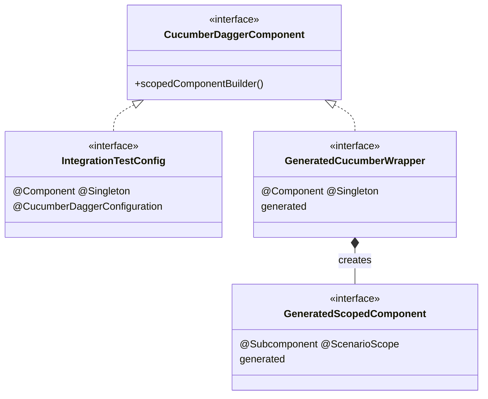
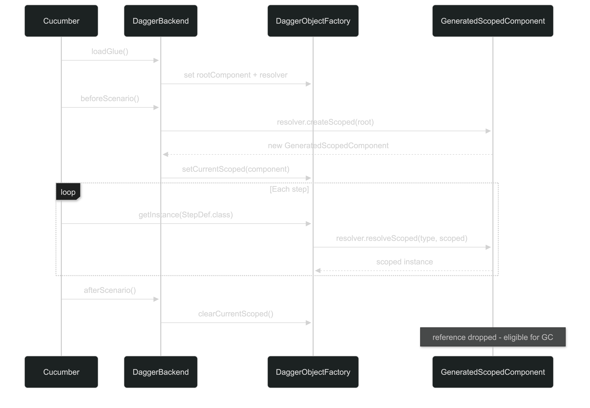

A few weeks ago, someone on my team came to ask me a question about how we wrote our functional tests: 'Why do we not use Dagger for our dependency injection in our cucumber tests when we use it universally for the application code?'.
I gave what felt like a disappointing answer: 

_"Dagger has no first class integration with cucumber."_

Feeling this answer wasn't completely satisfying, I went searching to see if someone had attempted to solve this problem. 
[Jamie Tanna][jvt] wrote an excellent post ['Using Dagger for Dependency Injection with Cucumber Tests'][jvt-post] (go and read after the fact) that details integrating the DI framework into acceptance tests manually. 
The summary is that you manually create the component and pull dependencies out of it in your step definitions, like this:

```java
public class StepDefinitions {

    private final Belly belly;
    public StepDefinitions() {
        this.belly = DaggerConfig.create().belly();
     }
}
```
Again, I felt a sense of lacklustre. 
This solution was missing that automagical dependency resolution and per-scenario state management that both the Spring and the PicoContainer DI integrations provide. 
I decided that with some time on my hands, I would solve this problem and this post details how I did it.

---

## What is Dagger?

If you're already sold on Dagger, skip ahead. If not, as JME famously said: If you don't know, get to know!

Dagger is a **compile-time dependency injection framework** for Java and Android. Unlike
Spring or Guice, which wire your object graph at runtime via reflection, Dagger runs as
an **annotation processor** during compilation and generates plain Java source code to
do the wiring. By the time your tests run there is no reflection, no magic, and no
surprises - just generated `Dagger*` classes that any IDE can navigate.

The key building blocks:

- **`@Component`** - the entry point to your object graph. Declare what you need; Dagger
  provides it.
- **`@Module`** - a class that tells Dagger how to construct things it can't figure out
  itself.
- **`@Inject`** - annotate a constructor and Dagger will create the type automatically.
- **`@Singleton`** (and other scopes) - control how many instances Dagger creates.

That's enough Dagger to follow the rest of this post. The [official docs][dagger-docs]
are genuinely good if you want to go deeper.

---

## What first-class Cucumber DI actually means

Cucumber has a pluggable DI contract: implement `ObjectFactory`, register it via
`META-INF/services`, and Cucumber will use your framework to resolve step definitions.
That's the whole interface.

In my opinion for a DI framework to be truly first-class here, it needs two things:

1. **Automatic glue code dependency wiring** - the glue code (step definitions and hooks) should be resolved from the
   application's dependency graph without any manual wiring or boilerplate per project.
2. **Per-scenario state management** - some objects need to be fresh for each scenario.
   Without this, you're back to mutable static state and the whole thing unravels.

---

## Automatic glue code dependency wiring - using an annotation processor

The obvious way to wire step definitions into a Dagger component at runtime would be
classpath scanning: find all classes annotated with Cucumber's step annotations, look
them up in the component, return them. Job done.

The problem is that this is exactly the kind of runtime reflection that Dagger was
designed to eliminate. Dagger's whole value proposition is that your dependency graph is
validated and resolved at compile time. Bolting a reflective classpath scanner onto the front of it would
undermine that entirely.

The natural answer is to do the same thing Dagger does: use an annotation processor.
At compile time, the processor can inspect your component, discover your step definition
classes, and generate a resolver that dispatches `getInstance` calls via a plain
`if (type == X.class)` chain. By the time your tests run, there is no scanning, no
reflection, and no surprises - just generated code, consistent with how Dagger itself
works.

This is why `cucumber-dagger` ships as both a runtime library *and* an annotation
processor. The processor does the structural work at build time so the runtime doesn't
have to.

> For a deeper look at the generated code and how the processor pipeline works, see the
> [architecture docs](https://github.com/jossmoff/dagger-cucumber/tree/main/docs/architecture.md).

---

## Per-scenario state management - Dagger subcomponents save the day!

In a well-structured acceptance test suite, some objects should live for the duration
of the entire test run - a database connection pool, an HTTP client, a price list loaded
from a fixture file. Others should be fresh for every scenario - a basket, a user
session, any state that accumulates during a scenario and must not bleed into the next.

PicoContainer handles this by recreating the entire container between scenarios. Simple,
if blunt. Every object is scenario-scoped by default because everything is thrown away
and rebuilt. The price you pay is that you lose shared singleton state, which forces
people into increasingly creative uses of static fields.

Dagger's mental model is different. A `@Component` is a sealed, immutable object graph.
You create it once, you use it, you don't modify it. There is no built-in concept of
"create this binding fresh for each test scenario."

The naive approaches are all bad:

- **Recreate the whole component between scenarios.** You lose singletons. Every
  scenario pays the full initialisation cost. Goodbye, shared HTTP client.
- **Manually null out fields in `@After` hooks.** Works until it doesn't. Mutable shared
  state is the thing we were trying to get away from.
- **One big mutable holder.** See above, with extra steps.

What we actually need is a way to say: *this part of the graph is per-run, and this part
is per-scenario*, with a clear boundary between them. Dagger has exactly that - it's
called a **subcomponent**.

A `@Subcomponent` is a child component that:

1. Has access to all bindings from its parent component.
2. Can declare its own scope (distinct from the parent's scope).
3. Is created by the parent - the parent controls the child's lifetime.
4. Is discarded when you stop holding a reference to it.

The parent component maps onto the test run. The subcomponent maps onto a single
scenario. You create it at the start of each scenario and drop the reference at the end.
The parent, and all its singletons, lives on unaffected.



The scope system enforces the lifetime boundary. `@Singleton` bindings live on the
parent; `@ScenarioScope` bindings live on the subcomponent.

> Everything you can do with `@ScenarioScope` — including passing state between step
> definition classes — is covered in the
> [scenario scope docs](https://github.com/jossmoff/dagger-cucumber/tree/main/docs/scenario-scope.md).

---

## How it all fits together

Annotate a component with `@CucumberDaggerConfiguration` and the annotation processor
takes over. Here's what it generates at compile time:

| Generated file                              | What it is           | Purpose                                                                                        |
|---------------------------------------------|----------------------|------------------------------------------------------------------------------------------------|
| `GeneratedCucumber*`                        | `@Component` wrapper | Extends your component and `CucumberDaggerComponent`; the Dagger entry point the runtime loads |
| `GeneratedScopedComponent`                  | `@Subcomponent`      | Holds all `@ScenarioScope` bindings; created and discarded per scenario                        |
| `GeneratedScopedModule`                     | `@Module`            | Declares the subcomponent factory; included in the wrapper's modules                           |
| `GeneratedComponentResolver`                | Plain class          | Dispatches `getInstance` calls to the right provision method without reflection                |
| `META-INF/services/CucumberDaggerComponent` | Service file         | Tells the runtime which `DaggerGeneratedCucumber*` class to load                               |

> Curious about what the generated code actually looks like? The
> [architecture docs](https://github.com/jossmoff/dagger-cucumber/tree/main/docs/architecture.md)
> walk through each file in detail.

At the start of each scenario a fresh `GeneratedScopedComponent` is created from the
root component and dropped at the end:


---

## Look how far we've come

To appreciate what first-class support actually buys you, it's worth looking at what the
manual approach requires. Without a dedicated library, each step definition has to
construct the Dagger component itself:

```java
// The manual approach — each step def wires itself up
public class StepDefinitions {
    private final Belly belly;

    public StepDefinitions() {
        this.belly = DaggerConfig.create().belly();
    }
}
```

And the component needs an explicit provision method for every type it vends:

```java
@Singleton
@Component(modules = ConfigModule.class)
public interface Config {
    Belly belly(); // manually listed for every step def
}
```

Every step definition constructs its own component. There's no shared graph, no
singleton state across step defs, and no path to scenario scoping whatsoever. It works
for a single step def class; it falls apart as soon as you have more than one.

Here's the same thing with `cucumber-dagger`. Add the dependencies:

```kotlin
// build.gradle.kts
dependencies {
    testImplementation(platform("dev.joss:cucumber-dagger-bom:<version>"))
    testImplementation("dev.joss:cucumber-dagger")

    testAnnotationProcessor("dev.joss:cucumber-dagger-processor")
    testAnnotationProcessor("com.google.dagger:dagger-compiler:<dagger-version>")
}
```

Declare your root component. `@CucumberDaggerConfiguration` is the only addition —
everything else is standard Dagger:

```java
@CucumberDaggerConfiguration
@Singleton
@Component(modules = {AppModule.class, ScenarioModule.class})
public interface IntegrationTestConfig { }
```

Singleton bindings go in `AppModule`, scenario-scoped bindings in `ScenarioModule`:

```java
@Module
public abstract class AppModule {

    @Provides
    @Singleton
    static HttpClient provideHttpClient() {
        return HttpClient.newHttpClient(); // one instance for the whole test run
    }
}

@Module
public class ScenarioModule {

    @Provides
    @ScenarioScope
    static Basket provideBasket(HttpClient client) {
        return new Basket(client); // fresh instance per scenario
    }
}
```

Step definitions just declare what they need:

```java
public class CheckoutSteps {

    private final Basket basket;

    @Inject
    public CheckoutSteps(Basket basket) {
        this.basket = basket;
    }

    @Given("a customer has {int} items in their basket")
    public void customerHasItems(int count) {
        basket.addItems(count);
    }
}
```

No `ObjectFactory`. No provision methods. No component construction in step defs.
The `Basket` is recreated for every scenario; the `HttpClient` is not. Run
`./gradlew test` and Dagger handles the rest.

> Ready to set this up in your own project? The
> [getting started guide](https://github.com/jossmoff/dagger-cucumber/tree/main/docs/getting-started.md)
> covers dependencies, configuration, and the full feature set.

---

## Conclusion

The core insight is that the problem isn't "Dagger doesn't support test DI" - it's that
nobody had written the annotation processor to make it seamless. The wiring was always
possible; the ergonomics just weren't there.

`cucumber-dagger` adds:

- Automatic step definition discovery and provision - no manual listing.
- First-class `@ScenarioScope` via generated subcomponents.
- Compile-time safety: bad scope relationships fail the build, not the test run.
- Support for `@Binds`, `@BindsOptionalOf`, multibindings, `Provider<T>`, and
  `@BindsInstance` - the full Dagger feature set, because you're writing real Dagger. 
  - I am sure that I have missed some nuances here, so if you have a use case that doesn't work, please open an issue and I'll fix it.

The full setup guide, configuration reference, and troubleshooting docs are in the
[README][readme].

[dagger-docs]: https://dagger.dev
[readme]: https://github.com/jossmoff/dagger-cucumber
[jvt]: https://www.jvt.me
[jvt-post]: https://www.jvt.me/posts/2021/12/30/cucumber-dagger-dependency-injection/
